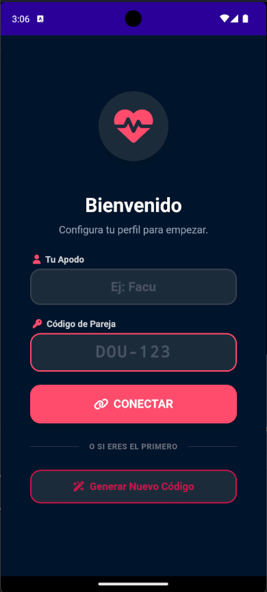
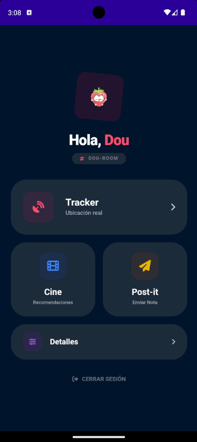
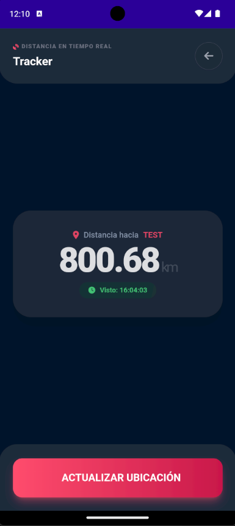
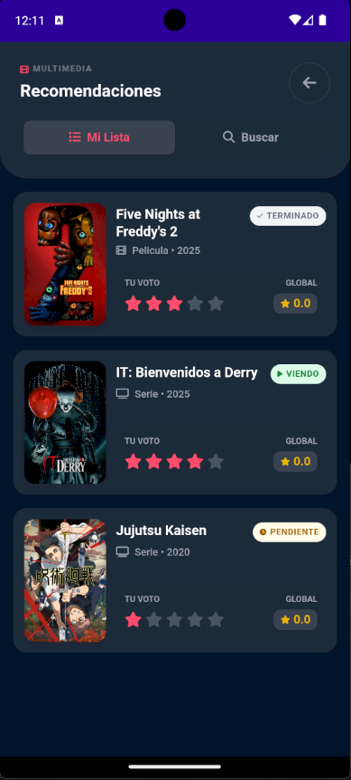
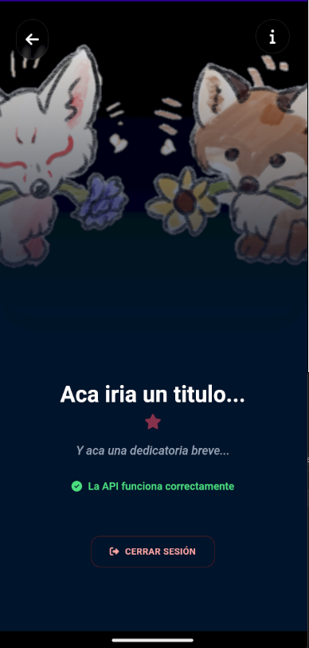

# DouTracker (TrackerApp)

<div align="center">
  
</div>

<div align="center">

      

</div>

**DouTracker** es un sistema diseñado para parejas, que incluye varias funciones como medir la distancia entre ambos usuarios, gestionar recomendaciones de peliculas y series y enviar mensajes tipo "Post-It".

Este sistema cuenta con dos componentes principales, siendo este la aplicación de telefono hecha en .NET MAUI 8 (solo para Android) y una API (tambien en .NET 8)

## Características Principales

* **Rastreo de Ubicación:** Visualización de la distancia entre dispositivos vinculados mediante `PairingCode`.
* **Media Hub:** Recomendaciones de películas y series integradas con la API de **TMDB**. Permite añadir, calificar y cambiar el estado (Pendiente, Viendo, Terminado).
* **Mensajería Post-It:** Sistema de notas rápidas entre dispositivos.
* **Notificaciones Locales:** Alertas en el dispositivo móvil.

## Stack Tecnológico

### Mobile App (Cliente)
* **.NET MAUI 8** (Android)
* **Blazor Hybrid:** Interfaz de usuario construida con componentes Razor y HTML/CSS.
* **Tailwind CSS:** Framework para el diseño rápido y moderno de la UI.
* **Plugin.LocalNotification:** Gestión de notificaciones nativas.

### Backend (API)
* **.NET 8 Web API**.
* **Dapper:** Micro-ORM para consultas eficientes a la base de datos.
* **SQL Server:** Motor de base de datos relacional.
* **Swagger:** Documentación y pruebas de endpoints.
* **Docker Support:** Preparado para contenedorización (Linux).

---

## Prerrequisitos

Para ejecutar este proyecto localmente necesitas:

1.  **.NET 8 SDK** instalado.
2.  **SQL Server** (LocalDB o instancia completa).
3.  **Visual Studio 2022** (con cargas de trabajo de MAUI y ASP.NET).
4.  Una **API Key de TMDB** (The Movie Database). Puedes obtenerla gratis si estas registrado en [themoviedb.org](https://www.themoviedb.org/).

---

## Configuración y Despliegue Local

Sigue estos pasos para poner en marcha el sistema:

### 1. Base de Datos
Ejecuta el script SQL (`Docs/SQLQuery - SQL Server.sql`) en tu servidor de SQL Server para crear la base de datos `DouTrackerDB` y sus tablas (`UserLocations`, `Recommendations`, `PostItMessages`, etc.).

### 2. Configurar la API (TrackerAPI)
La API necesita conectarse a la base de datos y a TMDB.

1.  Navega a la carpeta `TrackerAPI`.
2.  Crea o modifica el archivo `appsettings.json`.
3.  **Importante:** Asegúrate de configurar tu `CadenaSQL` y tu `ApiKey` de TMDB.

```json
{
  "ConnectionStrings": {
    "CadenaSQL": "Server=localhost;Database=DouTrackerDB;Integrated Security=true;Encrypt=True;TrustServerCertificate=True;"
  },
  "Tmdb": {
    "ApiKey": "TU_API_KEY_AQUI"
  },
  "Logging": {
    "LogLevel": {
      "Default": "Information",
      "Microsoft.AspNetCore": "Warning"
    }
  }
}
```
*Nota: El proyecto usa Dapper y `Microsoft.Data.SqlClient`, por lo que la cadena de conexión debe ser estándar para SQL Server.*

### 3. Configurar la App Móvil (TrackerApp)
La aplicación móvil necesita saber dónde está alojada la API.

1.  Navega a la carpeta `TrackerApp`.
2.  Ubica el archivo `appsettings.json` dentro de la carpeta raíz (este archivo está marcado como `EmbeddedResource`).
3.  Define la `BaseUrl`. Si estás probando en el emulador de Android y tu API corre en localhost, usa `http://10.0.2.2:PUERTO` (donde PUERTO es el puerto de tu API, ej. 5148). Para Windows, usa `localhost`.

```json
{
  "ApiSettings": {
    "BaseUrl": "http://10.0.2.2:5148" 
  }
}
```
*Recuerda: Si despliegas la API en un servidor (ej. Azure o Render), coloca aquí la URL pública (HTTPS).*

---

## Ejecución en Desarrollo

1.  **Iniciar API:** Abre la solución `TrackerAPI` y ejecútala. Asegúrate de que Swagger cargue correctamente y la base de datos sea accesible.
2.  **Iniciar App:** Abre la solución `TrackerApp`.
    * Selecciona el framework de destino (ej. `net8.0-android`).
    * Compila y ejecuta en tu emulador o dispositivo físico.

---

## Compilación y Generación de Ejecutables

Para generar los archivos listos para producción o instalación manual:

### App (APK para Android)
Para generar el instalador APK, ejecuta el siguiente comando en tu terminal (PowerShell o CMD) ubicándote dentro de la carpeta del proyecto `TrackerApp/TrackerApp`:

```powershell
dotnet publish -f net8.0-android -c Release -p:AndroidPackageFormat=apk
```
*El archivo `.apk` resultante se encontrará en la carpeta `bin/Release/net8.0-android/publish/`.*

### Backend (API)

Hay dos opciones para preparar la API para producción:

#### Opción A: Docker (Contenedor)
Si prefieres usar contenedores, asegúrate de tener Docker instalado y ejecuta desde la carpeta `TrackerAPI/TrackerAPI`:

```bash
docker build -t dou-tracker-api .
```

#### Opción B: PowerShell / .NET CLI (Manual)
Para compilar los binarios y ejecutarlos en un servidor (IIS, Windows Server, Linux):

```powershell
dotnet publish -c Release -o ./publish
```
*Los archivos compilados estarán en la carpeta `publish` listos para ser desplegados.*

---

## Notas sobre la UI

La interfaz utiliza **BlazorWebView**, lo que significa que gran parte de la UI reside en la carpeta `Components` y utiliza sintaxis Razor (.razor) con estilos web estándar, permitiendo una gran flexibilidad en el diseño.

## Consideraciones

No deberia ser muy complicado pasarlo a otro motor de bases de datos, pero yo estoy usando un proveedor que usa SQL Server (y ademas estoy más acostumbrado).


# Creditos
Desarrollado por [**lostdou**](https://github.com/Lostdou) .
Icono y dibujos por [**Iris**](https://www.instagram.com/iris_j.k/)


# Capturas de Pantalla

| Inicio de Sesión | Dashboard Principal | Rastreo GPS |
|:---:|:---:|:---:|
|  |  |  |

| Media Hub (Lista) | Detalles | Mensajes Post-It |
|:---:|:---:|:---:|
|  |  |  |